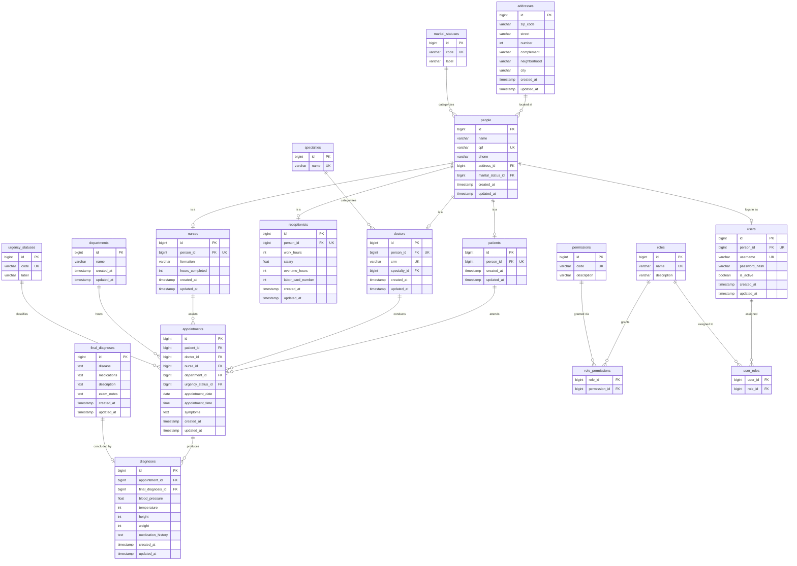

# Database Schema Redesign

**Status:** Proposal — diagram and documentation only, no DDL/DML/migration included.
**Related:** [prd: Clinic Database Schema Redesign](https://github.com/MarioFronza/avicena/issues/42)

## Purpose

The six-entity Clean Architecture migration ([docs/clean-architecture-migration.md](clean-architecture-migration.md))
cleaned up the application layer. The database underneath it is still the
original NetBeans-generated schema: Portuguese-only table/column names, a
`complento` typo, four person tables (`paciente`, `medico`, `enfermeiro`,
`atendente`) duplicating the same six columns, two enums (`MaritalStatus`,
`UrgencyStatus`) persisted as raw ordinal integers with no referential
integrity, and no concept of authentication or authorization anywhere in the
system.

This document proposes a redesigned schema that fixes those problems and adds
authentication/authorization from scratch. It is deliberately just a design —
turning this into real DDL, JPA entities, and a data migration is separate,
future work.

## Design principles

- **English naming everywhere.** Every table and column name translates the
  current Portuguese schema, and fixes the `complento` → `complement` typo
  along the way.
- **Normalize the person shape.** `patients`, `doctors`, `nurses`, and
  `receptionists` currently duplicate `nome`/`cpf`/`telefone`/`endereco`/
  `estado_civil` four times over. The redesign factors that into one shared
  `people` table, with each role table holding a 1:1 reference plus only its
  own role-specific columns.
- **Replace raw ordinals with lookup tables.** `MaritalStatus` and
  `UrgencyStatus` are stored today as bare integers with no `@Enumerated`
  annotation — reordering either enum in Java silently corrupts existing
  data. The redesign replaces both with small reference tables
  (`marital_statuses`, `urgency_statuses`) referenced by foreign key, the
  same shape used for `roles`/`permissions`. New statuses can be added with
  an `INSERT`, not a schema change.
- **Authentication and authorization are new, not migrated.** Nothing in the
  current schema represents who is using the system. The redesign adds
  `users`, `roles`, `permissions`, and two join tables
  (`role_permissions`, `user_roles`) — a standard RBAC shape. `users`
  references `people` (not a specific role table), so any person —
  staff today, potentially a patient in a future portal — can have a login
  without a further redesign.
- **Real types for real data.** `appointments.date`/`.time` are stored as
  bare strings today. The redesign uses `date`/`time` columns.
- **Audit columns everywhere.** Every table gets `created_at`/`updated_at`,
  a convention borrowed from the Sakila reference schema's `last_update`
  pattern.
- **Small, cheap extensibility, nothing speculative.** `specialties` and
  `departments` are added because they're low-cost normalizations directly
  useful today (a doctor's specialty is categorical, not freetext) or a
  clear near-term need (multi-location support). Anything costlier —
  a medication/prescription catalog, multi-tenancy — is called out as a
  future extension point instead of being built now (see
  [Future extensions](#future-extensions)).

## Entity-relationship diagram

## Table reference

### People & contact

| Table | Purpose |
|---|---|
| `people` | Core identity shared by every human in the system: name, CPF, phone, address, marital status. Every role table (`patients`, `doctors`, `nurses`, `receptionists`) and `users` references exactly one row here. |
| `addresses` | Postal address. One address can be shared by more than one person (e.g. family members at the same address). |
| `marital_statuses` | Lookup table replacing the current ordinal-encoded `MaritalStatus` enum. Seed values: `SINGLE`, `MARRIED`, `DIVORCED`, `WIDOWED`, `OTHER` (order no longer matters — this is the whole point of the change). |

### Clinical staff & patients

| Table | Purpose |
|---|---|
| `patients` | Marks a `people` row as a patient. No extra columns today — everything patient-specific already lives on `people`. |
| `doctors` | Adds `crm` (medical license number) and a `specialty` reference to a `people` row. |
| `specialties` | Lookup table normalizing the doctor's specialty, currently a freetext column (`especializacao`). |
| `nurses` | Adds `formation` and `hours_completed` to a `people` row. |
| `receptionists` | Adds `work_hours`, `salary`, `overtime_hours`, `labor_card_number` to a `people` row. |

### Clinical records

| Table | Purpose |
|---|---|
| `departments` | Which part of the clinic an appointment belongs to. v1 ships with a single row (e.g. "General Practice"); exists so multi-department/multi-location support doesn't require a schema change later. |
| `urgency_statuses` | Lookup table replacing the current ordinal-encoded `UrgencyStatus` enum. Seed values: `EMERGENCY`, `URGENT`, `SLIGHTLY_URGENT`, `NOT_URGENT`. |
| `appointments` | One clinical visit: which patient, which doctor, optionally which nurse, which department, when, why (`symptoms`), and how urgent. |
| `diagnoses` | The primary-encounter record captured during the appointment (vitals, medication history). Mirrors the current `DiagnosisEntity`/`diagnostico_primario` table. |
| `final_diagnoses` | The signed-off diagnosis (disease, prescribed medications, description, exam notes) produced from a `diagnoses` row. Mirrors the current `FinalDiagnosisEntity`/`diagnostico_final` table. |

### Authentication & authorization

| Table | Purpose |
|---|---|
| `users` | Login credentials for a `people` row. `username`/`password_hash`/`is_active`. Not every person needs a `users` row — only those who actually log in. |
| `roles` | A named role a user can hold, e.g. `ADMIN`, `DOCTOR`, `NURSE`, `RECEPTIONIST`. |
| `permissions` | A single grantable action, e.g. `patient:write`, `appointment:read`. |
| `role_permissions` | Many-to-many join: which permissions a role grants. |
| `user_roles` | Many-to-many join: which roles a user holds. A v1 user will typically hold exactly one role, but the join table costs nothing extra and avoids a redesign if that ever changes. |

## Cardinality & cascade notes

- `people` → `patients`/`doctors`/`nurses`/`receptionists`/`users`: each is
  **zero-or-one**. A `people` row isn't required to be any role, and can be
  more than one at once if the data ever calls for it (e.g. a nurse who is
  also a patient) — the current schema can't represent that at all.
- `appointments` → `diagnoses`: **zero-or-many**, matching the current JPA
  mapping (`@ManyToOne`, not `@OneToOne`) even though in practice each
  appointment gets at most one diagnosis today.
- `diagnoses` → `final_diagnoses`: the foreign key lives on `diagnoses`
  (`final_diagnosis_id`). This relationship **cascades delete** in the
  current codebase (`DiagnosisEntity`'s `@ManyToOne(cascade = CascadeType.ALL)`
  is the one cascade-delete relationship in the whole system) — deleting a
  `diagnoses` row should delete its `final_diagnoses` row too. This is the
  only cascade-delete relationship carried forward from the current schema.
- `role_permissions` and `user_roles` have composite primary keys
  (`role_id, permission_id` and `user_id, role_id`) — no surrogate `id`
  needed on a pure join table.

## Mapping from the current schema

| Current table.column | New table.column | Note |
|---|---|---|
| `paciente.*`, `medico.*`, `enfermeiro.*`, `atendente.*` (nome/cpf/telefone/codigo_endereco/estado_civil) | `people.name/cpf/phone/address_id/marital_status_id` | Deduplicated into one shared table |
| `medico.crm`, `medico.especializacao` | `doctors.crm`, `doctors.specialty_id` | `especializacao` freetext becomes a `specialties` lookup |
| `enfermeiro.formacao`, `enfermeiro.hr_cursadas` | `nurses.formation`, `nurses.hours_completed` | Direct rename |
| `atendente.carga_horaria/salario/hora_extra/numero_carteira_de_trabalho` | `receptionists.work_hours/salary/overtime_hours/labor_card_number` | Direct rename |
| `endereco.*` (cep/rua/numero/**complento**/bairro/cidade) | `addresses.zip_code/street/number/complement/neighborhood/city` | Typo fixed |
| `consulta.data`, `consulta.hora` (String) | `appointments.appointment_date` (date), `appointments.appointment_time` (time) | Real date/time types |
| `consulta.sintomas`, `consulta.estado_paciente` | `appointments.symptoms`, `appointments.urgency_status_id` | Ordinal enum becomes lookup FK |
| `diagnostico_primario.pressao/temperatura/altura/peso/historico_remedio` | `diagnoses.blood_pressure/temperature/height/weight/medication_history` | Direct rename |
| `diagnostico_final.doenca/remedios/descricao/exame` | `final_diagnoses.disease/medications/description/exam_notes` | Direct rename |
| *(none — did not exist)* | `users`, `roles`, `permissions`, `role_permissions`, `user_roles` | New, additive |

## Deviations & rationale

- **`people` as a shared base table, not four independent tables.** The
  current schema repeats the same six columns four times with four separate
  primary key sequences. A shared table removes the duplication and is the
  natural place to hang a `users` login, since a login belongs to a person,
  not to a specific role.
- **Lookup tables over native Postgres `ENUM` types**, for both
  `marital_statuses` and `urgency_statuses`. A native `ENUM` is slightly
  cheaper at query time, but adding a value later (`ALTER TYPE ... ADD
  VALUE`) is more disruptive than an `INSERT`, and keeping the pattern
  identical to `roles`/`permissions` (also lookup tables) keeps the whole
  schema consistent rather than mixing two different extensibility
  mechanisms.
- **`users.person_id` references any `people` row, not a specific role
  table.** Costs nothing today (v1 only staff will actually have rows here)
  and avoids a second redesign if a patient portal ever needs logins.
- **`diagnoses`/`final_diagnoses` stay two tables, not one.** They map
  directly onto the current `DiagnosisEntity`/`FinalDiagnosisEntity` split,
  which mirrors a real clinical distinction (notes taken during the visit
  vs. the signed-off diagnosis produced from them) and preserves the
  existing cascade-delete behavior without redesigning it.

## Future extensions

Deliberately not designed in detail now, to keep v1 simple — noted here so
they're not forgotten:

- **Medication/prescription catalog.** `diagnoses.medication_history` and
  `final_diagnoses.medications` are still freetext. A real catalog
  (`medications`, `prescriptions`, `prescription_items`) is a natural v2
  step once prescriptions need to be searched, reused, or checked for
  interactions.
- **Multi-location / multi-tenancy.** `departments` gives appointments a
  place to attach to beyond a single implicit clinic, but there's no
  `clinics`/`locations` table yet. If the system ever serves more than one
  physical clinic, `departments` gets a `clinic_id` and a `clinics` table is
  added above it — this schema doesn't block that.
